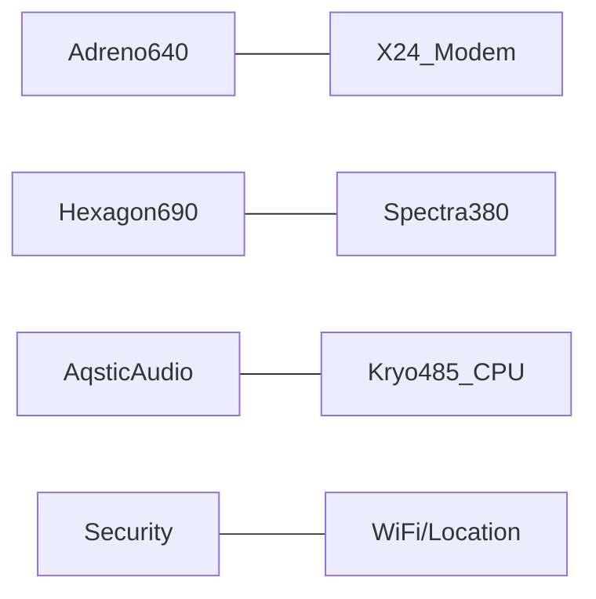

[TOC]

# 1 计算资源

智能终端主要是指智能手机设备，主要讨论的问题包括：
  - 智能终端上有哪些计算资源、哪些计算资源可以支持用户的应用程序（APP）以及用户使用这些资源的主要方式
  - 计算资源的特性、发展史和未来的技术迭代
  - 如何保证我们的库、应用程序最好的利用潜在计算资源并保证兼容性和健壮性

## 1.1 智能终端计算资源 
目前的智能手机上的计算资源包括DSP，CPU，GPU和NPU等。其中，用于支持用户开发应用程序的主要是CPU，DSP和NPU，NPU是随着深度学习的兴起，开始发展起来了，在此之前主要是CPU、GPU和DSP。

### 典型的智能手机SoC  
  - Qualcomm Snapdragon 855 SoC 2019[1]  
    - Adreno640是GPU，用于进行图形计算或者数值计算，支持OpenGL  ES3.2， Vulkan 1.1, OpenCL2.0；
    - X24 LTE Modem和Wifi模块都是通信处理器；
    - WiFi/Location: 无线、定位处理器   
    - Spectra380是图像感应处理器（ISP），相对于是照相机的硬件加速部件（例如支持硬件HDR算法）；  
    - Audio是低功耗声音处理芯片，同时也支持用于支持高级语音场景的加速器，例如语音助手，能否并发支持2个词的唤醒（谷歌、百度等），最高支持4mic的远场，  Always-on echo cancellation and noise suppression
    - Kro485, ARM 处理器，是高通基于ARMA76核重新设计得到的
    - Hexgon690，DSP协处理器，高通在DSP方面有很好的优势，在AI火热的今天，很多厂商在推出NPU芯片，高通的做法是延续其DSP策略，将AI加速能力仍然集成到该DSP中,690是其第四代AI芯片，里面含有scalar(4线程）、vector 加速器（2倍，HVX）、Tensor加速器（新加HTA）、voice assistant和all-ways aware，将CPU，GPU和DSP等能力综合起来看， 达到7OPS。
    - security：支持生物学认证（包括指纹、人脸等）、内容安全、token安全、可信执行环境等




  - Huawei Kirin990 SoC 201909

    ```mermaid
    graph LR
    
    MaliG76---Balong_Modem
    NPU_DaVinci---ISP5.0 
    HiFiAudio---CPU_Kirin990 
    LPDDR---HDR_4K
    ```

    Kirin990芯片分为5G版和非5G版，其中5G版的晶体管总数达到103亿。

    - NPU：华为自研的Da Vinci架构，采用大小核的异构架构，大核（Big-core）+小核（tiny-core)，990 5G版是2+1配置，非5G版是1+1配置。
    - GPU：堆积了16个Mali-G76的核，主频为600MHz
    - CPU：2个极大核（2.86GHz，Cortex-A76），2个大核（Cortex A76 2.36GHz），4个小核（Cortex A55 1.95Hz）
    - Balong modem：业内最快的下载速度，在sub-6GHz下达到2.3Gbps，上载速度达到1.25Gbps。同时支持2/3/4/5G
    - RAM：LPDDR4x ，主频为2133MHz，34.1GB/s

    

  - Apple A13 SoC 201909[4]

    ```mermaid
    graph LR
    
    Metal_Optimized_GPU---Audio-subsystem
    Neural-Engine---HDR_Video_Image
    Cameral-fusion---CPU_Lightning_Thunder
    
    
    ```

    苹果A13 Bionic芯片整体有8.5 billion个晶体管，由TSMC代工，采用的工艺为2nd代N7。
    
    - CPU：ARMv8.3-A指令集，采用达大小核异构（2*ligntning+4*thunder），大核主频为2.65GHz，相对于上一代CPU核性能提升20%同时功耗下降30%，4个效率核性能提升20%同时功耗下降40%。 
    - GPU：苹果自己设计的4核GPU，性能提升20%，功耗下降40%。
    - NPU：8-core Neural engine，性能提升20%，功耗下降15%，这里的NPU实际上包括AMXblocks，后者是双核，苹果宣称AMX blocks在MM上的性能是A12上的Vortex Core的6倍，AMX的性能达到1Tops。
    - AMX：也可以称之为矩阵协处理器，具体细节待查明。
    - 图像处理相关：ISP，Depth engine，HEVC encoder/decoder，video processor
    
- 小结

  上面提到的3个智能手机SoC平台是比较典型解决方案，当然，除此之外，还有其他厂商提供了类似方案，包括：三星，联发科，展讯（紫光展锐）等。手机厂商虽然有很多家，但是能够提供SoC解决方案的只有上述几家，苹果、三星和华为的SoC主要是为自家厂商提供解决方案，高通提供了从低端到高端的所有解决方案，联发科目前只能提供中低端的解决方案，紫光展锐提供中低端解决方案（？不太确定）。

  | processor | 编程方法 | 计算力 | 计算功耗 |
  | --------- | -------- | ------ | -------- |
  | CPU       |          |        |          |
  | GPU       |          |        |          |
  | NPU       |          |        |          |

  

  

## 1.2 NPU加速器

| Company   | Solution         | Features |
| --------- | ---------------- | -------- |
| Qualcomm  | Hexgon DSP       |          |
| ARM       |                  |          |
| Samsung   |                  |          |
| Huawei    | Da vinci         |          |
| Apple     | NPU              |          |
| Cambricon | 手机端提供IP授权 |          |
| 瑞芯微    | NPU              |          |


- QualComm

  

# 2.  开发环境   

- Qualcomm

支持AI的芯片有855, 845, 835, 821, 820 and 660
AI开发环境  

- Qualcomm® Neural Processing SDK  
  支持主要的计算部件，支持TF，pytorch和caffe等编程框架，定义了自己的模型格式DLC，只支持卷积（？）；

Google’s Android NN-API
Hexagon NN Library
Qualcomm® Math Library（QML）   
支持BLAS和LPACK计算，精度包括单精、双精和对应的复数。不支持int8和half？
有单线程版和多线程版，后者利用 Qualcomm® Snapdragon™ Heterogeneous Compute SDK实现。

# Reference   

[1] https://www.qualcomm.com/system/files/document/files/prod_brief_qcom_sd855_0.pdf
[2] https://developer.qualcomm.com/software/hexagon-dsp-sdk/dsp-processor
[3] http://www.aadhu.com/how-qualcomm-improved-performance-gaming-and-ai-on-the-snapdragon-855/

[4] https://en.wikipedia.org/wiki/Apple_A13 