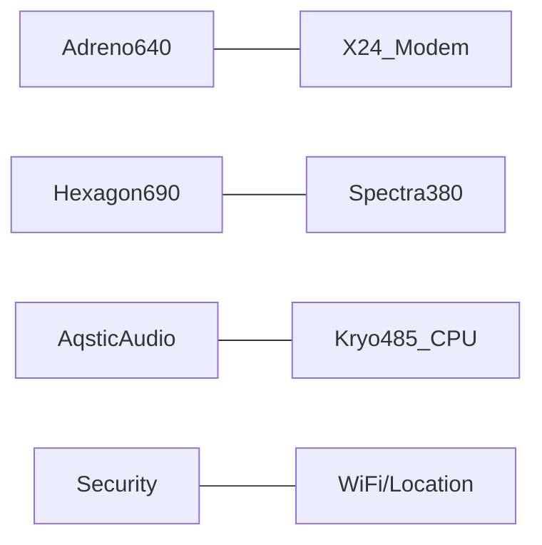

[TOC]

# 1 智能终端计算平台

智能终端主要是指智能手机和pad等设备，主要讨论的问题包括：
  - 智能终端上的主要计算平台，平台上的哪些计算资源可以支持用户的应用程序（APP），用户使用这些资源的主要方式

  - 计算资源的特性、发展史和未来的技术迭代

  - 如何保证我们的库、应用程序最好的利用潜在计算资源并保证兼容性和健壮性     

    

## 1.1 智能计算平台SoC   
目前的智能手机上的计算资源包括DSP，CPU，GPU和NPU等。其中，用于支持用户开发应用程序的主要是CPU，DSP和NPU，NPU是随着深度学习的兴起，开始发展起来了，在此之前主要是CPU、GPU和DSP。

### 典型的智能手机SoC  
  - Qualcomm Snapdragon 855 SoC 2019[1]  
    - Adreno640是GPU，用于进行图形计算或者数值计算，支持OpenGL  ES3.2， Vulkan 1.1, OpenCL2.0；
    - X24 LTE Modem和Wifi模块都是通信处理器；
    - WiFi/Location: 无线、定位处理器   
    - Spectra380是图像感应处理器（ISP），相对于是照相机的硬件加速部件（例如支持硬件HDR算法）；  
    - Audio是低功耗声音处理芯片，同时也支持用于支持高级语音场景的加速器，例如语音助手，能否并发支持2个词的唤醒（谷歌、百度等），最高支持4mic的远场，  Always-on echo cancellation and noise suppression
    - Kro485, ARM 处理器，是高通基于ARMA76核重新设计得到的
    - Hexgon690，DSP协处理器，高通在DSP方面有很好的优势，在AI火热的今天，很多厂商在推出NPU芯片，高通的做法是延续其DSP策略，将AI加速能力仍然集成到该DSP中,690是其第四代AI芯片，里面含有scalar(4线程）、vector 加速器（2倍，HVX）、Tensor加速器（新加HTA）、voice assistant和all-ways aware，将CPU，GPU和DSP等能力综合起来看， 达到7OPS。
    - security：支持生物学认证（包括指纹、人脸等）、内容安全、token安全、可信执行环境等




  - Huawei Kirin990 SoC 201909

    ```mermaid
    graph LR
    
    MaliG76---Balong_Modem
    NPU_DaVinci---ISP5.0 
    HiFiAudio---CPU_Kirin990 
    LPDDR---HDR_4K
    ```

    Kirin990芯片分为5G版和非5G版，其中5G版的晶体管总数达到103亿。

    - NPU：华为自研的Da Vinci架构，采用大小核的异构架构，大核（Big-core）+小核（tiny-core)，990 5G版是2+1配置，非5G版是1+1配置。
    - GPU：堆积了16个Mali-G76的核，主频为600MHz
    - CPU：2个极大核（2.86GHz，Cortex-A76），2个大核（Cortex A76 2.36GHz），4个小核（Cortex A55 1.95Hz）
    - Balong modem：业内最快的下载速度，在sub-6GHz下达到2.3Gbps，上载速度达到1.25Gbps。同时支持2/3/4/5G
    - RAM：LPDDR4x ，主频为2133MHz，34.1GB/s

    

  - Apple A13 SoC 201909[4]

    ```mermaid
    graph LR
    
    Metal_Optimized_GPU---Audio-subsystem
    Neural-Engine---HDR_Video_Image
    Cameral-fusion---CPU_Lightning_Thunder
    
    
    ```

    苹果A13 Bionic芯片整体有8.5 billion个晶体管，由TSMC代工，采用的工艺为2nd代N7。
    
    - CPU：ARMv8.3-A指令集，采用达大小核异构（2*ligntning+4*thunder），大核主频为2.65GHz，相对于上一代CPU核性能提升20%同时功耗下降30%，4个效率核性能提升20%同时功耗下降40%。 
    - GPU：苹果自己设计的4核GPU，性能提升20%，功耗下降40%。
    - NPU：8-core Neural engine，性能提升20%，功耗下降15%，这里的NPU实际上包括AMXblocks，后者是双核，苹果宣称AMX blocks在MM上的性能是A12上的Vortex Core的6倍，AMX的性能达到1Tops。
    - AMX：也可以称之为矩阵协处理器，具体细节待查明。
    - 图像处理相关：ISP，Depth engine，HEVC encoder/decoder，video processor
    
- 小结

  上面提到的3个智能手机SoC平台是比较典型解决方案，当然，除此之外，还有其他厂商提供了类似方案，包括：三星，联发科，展讯（紫光展锐）等。手机厂商虽然有很多家，但是目前能够提供成熟SoC解决方案的只有上述几家。苹果、三星和华为的SoC主要是为自家厂商提供解决方案，高通和联发科作为第三方提供智能手机SoC方案，高通提供了从低端到高端的所有解决方案，联发科目前只能提供中低端的解决方案，紫光展锐提供中低端解决方案（tbd不太确定）。   

  从上面典型的SoC解决方案我们可以看到，上面的主要计算资源包括CPU、GPU、NPU和其他用于特定场景的定制化DSP，本文的目标是帮助应用开发用户来理解现有的智能手机平台上有哪些可以利用的计算资源，、这些计算资源的能力、如何来用这些计算能力和未来的发展趋势。本着上述目的，本文重点关注CPU、GPU和NPU。   
  
  
  

  Tabel 1. 主要计算资源介绍       


| processor | 编程方法                                                     | 计算力                                        | 计算功耗               |
| --------- | ------------------------------------------------------------ | :-------------------------------------------- | ---------------------- |
| CPU       | 提供API及常用的编译器，支持C、C++和java等常用编程语言        | 提供通用计算能力，支持任意计算类型            | 功耗大，性能功耗比较低 |
| GPU       | 用于图像渲染和数值计算，前者的编程框架包括OpenGL和Vulkan，支持数值计算的框架包括OpenCL、Renderscript和Vulkan等编程语言，Android平台不提供原生的OpenCL编程支持（谷歌提供了自己的renderscript解决方案），但是手机厂商一般会提供支持。 | 计算能力高于CPU，主要用于图像渲染或者加速计算 | 性能功耗比由于CPU      |
| NPU       | 一般只提供SDK，里面集成了典型的深度学习神经网络，不提供面向应用开发的编程接口。 | 计算能力最强，但是支持特殊的计算类型          | 性能功耗比最好         |

  

  


## 1.2 CPU

​	

### 1.2.1  ARM指令集版本介绍

​     现在常用的ARM指令集从支持的指令字长度来划分主要包括32bit和64bit，前者是指ARMv7指令集（A32），后者是指ARMv8指令集，64-bit的ARMv8-A也称之为AArch64，ARMv8-A也会在用户层兼容ARMv7-A（32-bit指令集），这时后者被称之为AArch32，。ARMv8指令集又分为ARMv8.1-A， ARMv8.2-A，ARMv8.3-A，ARMv8.4-A等版本。

​	ARM在未来的架构中会引入SVE2（Scalable Vector Extension2）和TME（Transational Memory Extension），clang9.0和GCC10已经在开发支持代码。

​	ARMv8.0-A是一个大的指令升级，所以详细介绍一下相对之前指令集的变化：

- 32个通用64-bit寄存器
- PC寄存器不能直接访问
- 指令是32bit长，并且多数指令仍然采用32bit和64bit参数
- Advanced SIMD（NEON）加强
  - 32x 128-bit 寄存器
  - 完全支持IEEE754

| version   | date    | feature                                                      |
| --------- | ------- | ------------------------------------------------------------ |
| ARMv7     |         |                                                              |
| ARMv8.0-a | 2011.10 | 指令集从32bit扩展到64bit；1. 32个通用64-bit寄存器；2. pc不能访问；3. 指令仍然是32bit的；4. 地址默认为64-bit； |
| ARMv8.1-a | 2014.12 | 1. 扩展乘加指令（标量和向量）；2. load/store指令；3.read-write原子操作； |
| ARMv8.2-a | 2016.01 | 1.支持half类型计算； 2. 对int8乘法有更好支持；3. SVE扩展，向量操作扩展到128-2048bit，服务器，该扩展在2019年已经被GCC8和clang支持。 |
| ARMv8.3-a | 2016.10 | 1. simd 复数支持；2.支持弱一致性；3. 支持更大片上cache       |
| ARMv8.4-a | 2017    | 1. 加密、安全； 2. 虚拟化支持； 3. dot product指令（SDOT，UDOT）；4. 支持FP16的乘法，加减指令 |
| ARMv8.5-a | 2018    | 1. MTE（Memory Tagging Extension）和BTI（branch target indications)；2.真随机数生成 |
| ARMv8.6-A | 201909  | 1. 增加通用GEMM; 2. 支持Bfloat16 format，增强虚拟化、系统管理和安全；3. 引入新的SIMD matrix manipulation instructions（BFDOT，BFMMLA, BFMLAL, BFCVT） |
|           |         |                                                              |


#### 指令扩展解释

- dot计算指令 [^5]

ARMv8.4-A中的dot计算指令能够加速深度学习应用算法，该指令扩展是可选的，在A55和A75处理器中支持该指令。通过下面代码示例可以看到，单条SIMD指令可以计算16个int8操作，中间结果直接存储在int数据中，最终输出类型也是int类型。

```bash
uchar a[N], b[N];
uint sum = 0;
for(int i = 0; i < N; i++){
	sum += a[i] * b[i];
}
```

- bfloat16 (Brain Floating Point) float-point format[^6,7]

  16bit的float数，用来加速机器学习和near-sensor计算，精度与float一致，指数部分为8bit，但是只支持8bit精度，而不是fp32bit中的24bit（AI处理器中多支持该操作，包括Nervana，TPU）。

```bash
# bf16
sign bit: 1
exponent width: 8 bits
significand precision: 7-bits

# IEEEf16
sign bit: 1
exponent width: 5 bits
significand precision: 10bits

# IEEE f32
sign bit: 1
exponent width: 8 bits
significand precision: 23bits 
```

- BFDOT, BFMMLA, BMLAL, BFCVT[6,7]

  通用矩阵运算指令，操作数是bf16，累加数是float32, ARM的该指令集扩展，相当于是在CPU中增加对深度学习场景的支持，这种支持不能改变ARM处理器仍然是通用处理器，应该无法替代专用的AI加速器。

```bash
# BFDOT [1x2] x [2x1]
IEEE32 += BF16 * BF16
# BFMMLA [2x4] x [4x2] // 相当于将两个BFDOT指令合并到一起
IEEE32[2x2] += BF16[2x4] * BF16[4x2]
# BFMLAL 支持奇数和偶数的BF16元素
# BFCVT 将IEEEFP32转换成BF16


```

### 1.2.2 ARM CPU  

​     ARM的处理器又被称之为公版处理器，通常以IP授权的形式授权给第三方，ARM的公版处理器一般是最早启用新的指令集，最近苹果的A处理器在这方面超过了ARM的公版处理器，部分重点ARM 微处理器架构如下表所示。


​                                                     Table 2. ARM 推出的微处理器架构表格

| CPU  | ISA Version | Features                                                     | 说明                      | Date    |
| ---- | ----------- | :----------------------------------------------------------- | :------------------------ | ------- |
| A32  | ARMv8-A     | 32bit，双发射，in-order pipeline                             | 32-bi ARMv8-A处理器       |         |
| A53  | ARMv8-A     | 2-width decoder, in-order pipeline                           | 第一代little core，1-4SMP | 2012.10 |
| A57  | ARMv8-A     | 3-width decode superscalar, deeply out of order pipline；L1：48+32KB；L2：512KB-2MB shared | 第一代big core， 1-4SMP   | 2012.10 |
| A72  | ARMv8-A     | 3-width decode superscalar, deeply out of order pipline；L1：48+32KB；L2：512KB-2MB shared | 第二代big core， 1-4SMP   | 201504  |
| A73  | ARMv8-A     | 2-width decode superscalar, deeply out of order pipline；L1：48+32KB；L2：256KB-8MB shared | 第三代big core            | 201605  |
| A55  | ARMv8.2-A   | 2-width decode superscalar,in-oder pipline；L1：16-64KB；L2：256KB；L3：4MB | 2nd小核                   | 201705  |
| A75  | ARMv8.2-A   | 3-width decode superscalar,deeply out of oerder pipline；L1：64+64KB；L2：512KB；L3：4MB | 4th big core;             | 201705  |
| A76  | ARMv8.2-A   | 4-width decode superscalar, 8-way issue, 13 stage pipeline, deeply out-of-order pipeline；64 / 64 kB L1, 256−512 kB L2 per core, 512 kB−4 MB L3 shared | big core                  | 201805  |
| A77  | ARMv8.2-A   | 4-width decode superscalar, 6-width instruction fetch, 12-way issue, 13 stage pipeline, deeply out-of-order pipeline；1.5K L0 MOPs cache, 64 / 64 kB L1, 256−512 kB L2 per core, 512 kB−4 MB L3 shared | big core                  | 201905  |


​	目前，ARM公开的指令集扩展已经到ARMv8.6-A，但是ARM公版IP核只发展到ARMv8.2，实际上，ARM有时候也会将更新版本的指令放到当前的IP核中，例如在ARM Cortex-A55核中就支持了ARMv8.4-A指令扩展中的dot product指令。

- Big.Little大小核异构设计

   从2011年开始（TBD），手机平台开始引入大小核异构架构，第一代的big-little设计是A53+A57，从2017年5月份开始，大小设计进入ARMv8.2-A指令集，小核是A55， 大核实A75，A76和A77。

- 架构对机器学习领域的支持

   ARM指令集在发展过程中，随着机器学习的发展和重要性的不断提升，也在指令集演变过程中增加了对其支持，这些支持虽然没有像AI芯片那样对时下快速发展的深度学习提供更完整的支持，但是这些指令扩展对于提升深度学习场景中的核心计算效率有很大帮助。

   - 量化操作

      ARM在ARMv8-A处理器中，引入fp16数据类型，但是在处理器指令上没有对此支持。在ARMv8.2-A指令扩展中引入fp16的计算指令，开始支持fp操作数的计算。

      ARMv8.0-A指令集的处理器支持int8操作，但是由于没有在指令集上扩展对应指令，计算效率较低。在ARMv8.4-A指令扩展中引入了dot  product操作，能够更好的支持int8计算，该指令扩展从Cortex A55/A75开始支持。

   - BFloat16

      具体参考#《指令集扩展解释》。  

   - GEMM

      通用矩阵计算，增加了支持矩阵运算的指令。

### 1.2.3 高通SoC[^8][^9]

​	高通给大家的印象应该是，国内的很多手机厂商的旗舰机都用的高通的处理器，另外就是高通是一个专利大鳄，所有手机厂商都要向他交专利费，这些内容这里不再涉及。本文主要介绍高通的Snapdragon SoC。

​	高通在2006年发布Snapdragon SoC（骁龙处理器），包括自有架构的Scorpion CPU、第一代DSP和其他半导体处理器，Scorpion是第一款性能达到1GHz的移动设备处理器。2008年，高通正式推出基于Scorpion架构的SoC。

​	2011年，高通发布第二代自有处理器架构Krait，并将处理器从低到高划分为S1， S2，S3，S4，其中S4又被分为Play、Plus、Pro和Prime四个等级。

​	2013年，高通发表新一代处理器Snapdragon600,800，采用Krait 400架构，同时公布新的命名规则：200（S4 Play）, 400（S4 Plus）, 600（S4 Pro）, 800（S4 Prime）。

​	 2014年4月高通公布了旗下第一款64位架构处理器Snapdragon 810、808，不同于以往Snapdragon处理器，S810以及S808采用ARM标准架构，S810采用4+4核心的A57+A53架构，S808则采用2+4核心的A57+A53架构。

​	2015年9月高通回归自主架构，发表新的Kryo架构设计以及新一代旗舰处理器平台S820。 

- Scorpion[^10][^11]

  Scorpion是高通基于ARMv7设计的处理器，在架构上与ARM Cortex-A8和Cortex-A9处理器的核。

  - 10/12 stage integer pipeline with 2-way decode, 3-way [out-of-order](https://en.wikipedia.org/wiki/Out-of-order_execution) speculatively issued [superscalar](https://en.wikipedia.org/wiki/Superscalar) execution
  - Pipelined VFPv3[[2\]](https://en.wikipedia.org/wiki/Scorpion_(CPU)#cite_note-2) and 128-bit wide [NEON](https://en.wikipedia.org/wiki/NEON_(instruction_set)) ([SIMD](https://en.wikipedia.org/wiki/SIMD))
  - 3 execution ports
  - 32 KB + 32 KB L1 [cache]
  - 256 KB (single-core) or 512 KB ([dual-core](https://en.wikipedia.org/wiki/Dual-core)) L2 cache
  - Single or dual-core configuration

- Krait[^12]

  - 11 stage integer pipeline with 3-way decode and 4-way [out-of-order](https://en.wikipedia.org/wiki/Out-of-order_execution) [speculative issue](https://en.wikipedia.org/wiki/Speculative_execution) [superscalar](https://en.wikipedia.org/wiki/Superscalar) execution
  - Pipelined VFPv4[[2\]](https://en.wikipedia.org/wiki/Krait_(CPU)#cite_note-2)[under [discussion](https://en.wikipedia.org/wiki/Talk:Krait_(CPU)#floating_point_version)] and 128-bit wide [NEON](https://en.wikipedia.org/wiki/NEON_(instruction_set)) ([SIMD](https://en.wikipedia.org/wiki/SIMD))
  - 7 execution ports
  - 4 KB + 4 KB direct mapped L0 [cache](https://en.wikipedia.org/wiki/CPU_cache)
  - 16 KB + 16 KB 4-way set associative L1 cache
  - 1 MB ([dual-core](https://en.wikipedia.org/wiki/Dual-core)) or 2 MB (quad-core) 8-way set-associative L2 cache
  - Dual or quad-core configurations
  - Performance (DMIPS/MHz):
    - Krait 200: 3.3 (28 nm LP)
    - Krait 300: 3.39[[3\]](https://en.wikipedia.org/wiki/Krait_(CPU)#cite_note-3) (28 nm LP)
    - Krait 400: 3.39 (28 nm HPm)
    - Krait 450: 3.51 (28 nm HPm)

- Kryo[^13]


### 1.2.4 苹果A系列SoC


### 1.2.5 三星 SoC


### 1.2.6  华为SoC


## 1.3 GPU


## 1.4 NPU加速器

| Company   | Solution         | Features                                                     |
| --------- | ---------------- | ------------------------------------------------------------ |
| Qualcomm  | Hexgon DSP       |                                                              |
| ARM       |                  |                                                              |
| Samsung   |                  |                                                              |
| Huawei    | Da vinci         | 1. 支持标量、向量和矩阵三种操作类型。2. 大小核异构。3.arm通用核加加速核。 |
| Apple     | NPU              |                                                              |
| Cambricon | 手机端提供IP授权 |                                                              |
| 瑞芯微    | NPU              | 提供OpenCL编程支持。                                         |


# 2.  开发环境   

## Qualcomm

支持AI的芯片有855, 845, 835, 821, 820 and 660
AI开发环境  

- ### Qualcomm® Neural Processing SDK  
  
  支持主要的计算部件，支持TF，pytorch和caffe等编程框架，定义了自己的模型格式DLC，只支持卷积（？）；

Google’s Android NN-API
Hexagon NN Library
Qualcomm® Math Library（QML）   
支持BLAS和LPACK计算，精度包括单精、双精和对应的复数。不支持int8和half？
有单线程版和多线程版，后者利用 Qualcomm® Snapdragon™ Heterogeneous Compute SDK实现。

# Reference   

[1] https://www.qualcomm.com/system/files/document/files/prod_brief_qcom_sd855_0.pdf
[2] https://developer.qualcomm.com/software/hexagon-dsp-sdk/dsp-processor
[3] http://www.aadhu.com/how-qualcomm-improved-performance-gaming-and-ai-on-the-snapdragon-855/

[4] https://en.wikipedia.org/wiki/Apple_A13 

[5] https://community.arm.com/developer/tools-software/tools/b/tools-software-ides-blog/posts/exploring-the-arm-dot-product-instructions

 [6] https://en.wikipedia.org/wiki/Bfloat16_floating-point_format

[7] https://community.arm.com/developer/ip-products/processors/b/ml-ip-blog/posts/bfloat16-processing-for-neural-networks-on-armv8_2d00_a  

[8]  https://en.wikipedia.org/wiki/Qualcomm_Snapdragon   

[9] https://en.wikipedia.org/wiki/Qualcomm 

[10]  https://en.wikipedia.org/wiki/List_of_ARM_microarchitectures 

[11]  https://en.wikipedia.org/wiki/Scorpion_(CPU)  

[12]  https://en.wikipedia.org/wiki/Krait_(CPU) 

[13]  https://en.wikipedia.org/wiki/Kryo 
