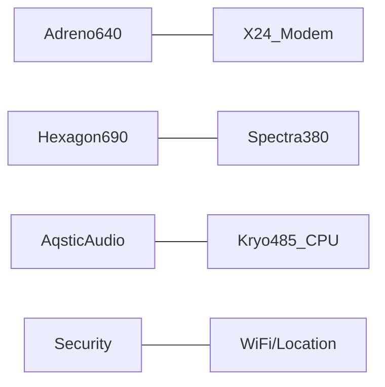

[TOC]

# 1 智能终端计算资源

智能终端主要是指智能手机设备，主要讨论的问题包括：
  - 智能终端上有哪些计算资源、哪些计算资源可以支持用户的应用程序（APP）以及用户使用这些资源的主要方式
  - 计算资源的特性、发展史和未来的技术迭代
  - 如何保证我们的库、应用程序最好的利用潜在计算资源并保证兼容性和健壮性

## 1.1 主要计算资源 
目前的智能手机上的计算资源包括DSP，CPU，GPU和NPU等。其中，用于支持用户开发应用程序的主要是CPU，DSP和NPU，NPU是随着深度学习的兴起，开始发展起来了，在此之前主要是CPU、GPU和DSP。

### 典型的智能手机SoC  
  - Qualcomm Snapdragon 855 SoC 2019[1]  
    - Adreno640是GPU，用于进行图形计算或者数值计算，支持OpenGL  ES3.2， Vulkan 1.1, OpenCL2.0；
    - X24 LTE Modem和Wifi模块都是通信处理器；
    - Spectra380是图像感应处理器（ISP），相对于是照相机的硬件加速部件（例如支持硬件HDR算法）；  
    - Audio是低功耗声音处理芯片，同时也支持用于支持高级语音场景的加速器，例如语音助手，能否并发支持2个词的唤醒（谷歌、百度等），最高支持4mic的远场，  Always-on echo cancellation and noise suppression
    - Kro485, ARM 处理器，是高通基于ARMA76核重新设计得到的
    - Hexgon690，DSP协处理器，高通在DSP方面有很好的优势，在AI火热的今天，很多厂商在推出NPU芯片，高通的做法是延续其DSP策略，将AI加速能力仍然集成到该DSP中,690是其第四代AI芯片，里面含有scalar(4线程）、vector 加速器（2倍，HVX）、Tensor加速器（新加HTA）、voice assistant和all-ways aware，将CPU，GPU和DSP等能力综合起来看， 达到7OPS。
    - security：支持生物学认证（包括指纹、人脸等）、内容安全、token安全、可信执行环境等

支持AI的芯片有855, 845, 835, 821, 820 and 660
AI开发环境  
- Qualcomm® Neural Processing SDK  
  支持主要的计算部件，支持TF，pytorch和caffe等编程框架，定义了自己的模型格式DLC，只支持卷积（？）；

Google’s Android NN-API
Hexagon NN Library
Qualcomm® Math Library（QML）   
支持BLAS和LPACK计算，精度包括单精、双精和对应的复数。不支持int8和half？
有单线程版和多线程版，后者利用 Qualcomm® Snapdragon™ Heterogeneous Compute SDK实现。

  - Huawei Kirin990 SoC 201909

  - 
  
  - Apple A13 SoC 201909

# Reference   

[1] https://www.qualcomm.com/system/files/document/files/prod_brief_qcom_sd855_0.pdf
https://developer.qualcomm.com/software/hexagon-dsp-sdk/dsp-processor
http://www.aadhu.com/how-qualcomm-improved-performance-gaming-and-ai-on-the-snapdragon-855/